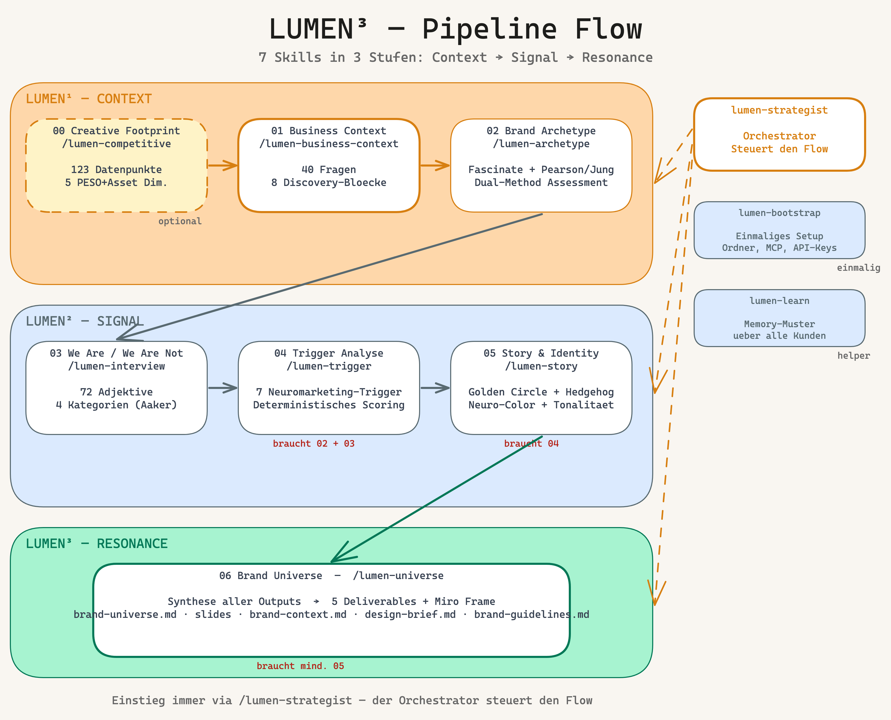
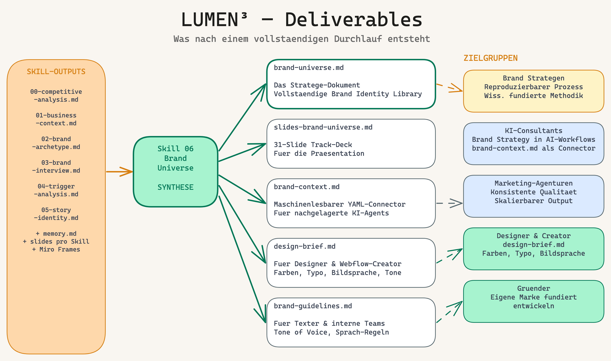
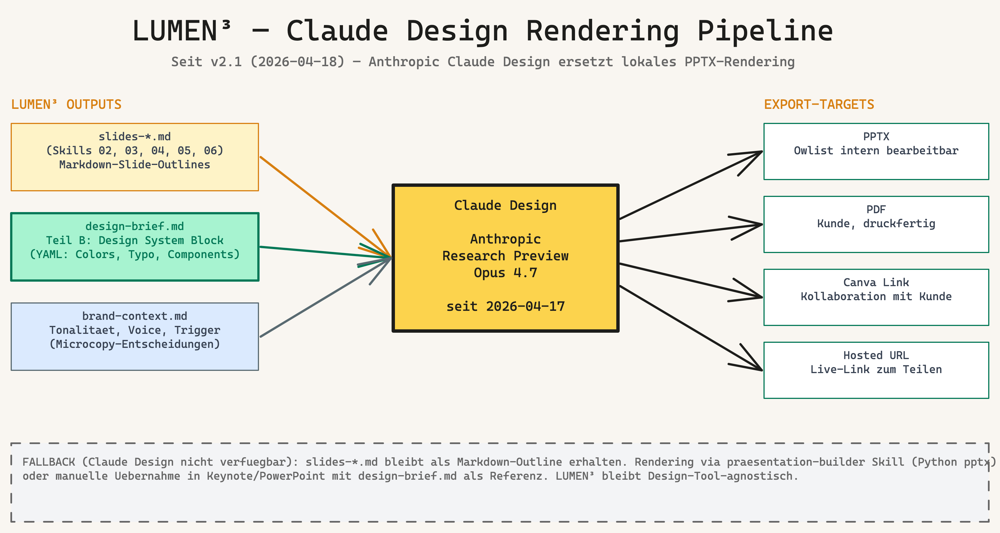
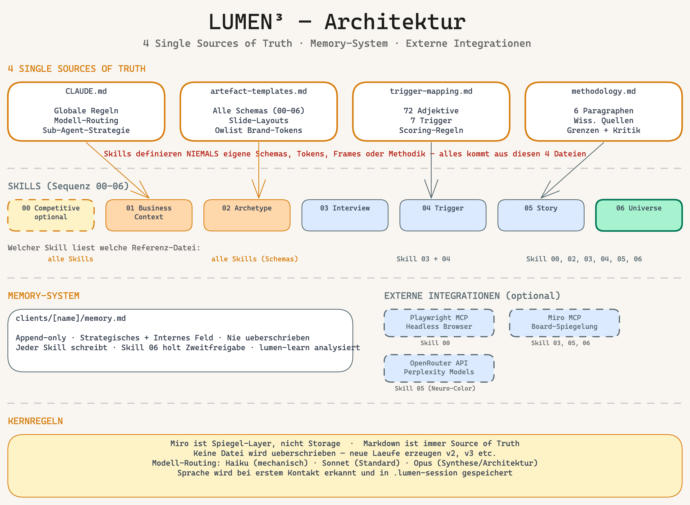

# LUMEN³ — Brand Signal Framework

**Ein strukturiertes, deterministisches Brand Discovery Framework für Claude Code.**

LUMEN³ führt durch den vollständigen Markenentwicklungsprozess: von der Wettbewerbsanalyse über Archetyp-Assessment und Neuromarketing-Trigger bis zum fertigen Brand Universe. Jeder Schritt ist dokumentiert, reproduzierbar und maschinenlesbar.

**By:** [Owlist GmbH](https://www.owlist.ch) · **Version:** 2.2 · **April 2026** (Brand Visual System)

---

## Was LUMEN³ ist — in einem Satz

LUMEN³ ist **8 Claude-Code-Skills** in **3 Stufen** (Context, Signal, Resonance) plus einem **Visual System Skill**, die gemeinsam eine vollständige Brand Identity Library für bestehende oder neue Marken erstellen — mit wissenschaftlich begründeten Methoden, transparenten Quellen und deterministischem Scoring.

### Pipeline Flow



## Die 8 Skills

| Skill | Trigger | Dauer | Was er tut |
|---|---|---|---|
| **00 Creative Footprint** | `/lumen-competitive` | 60–120 Min | Wettbewerbsanalyse: 123 Datenpunkte in 5 Dimensionen (PESO+Asset) + 4 visuelle Analyse-Module + `DESIGN.md` pro Wettbewerber (v2.2) |
| **01 Business Context** | `/lumen-business-context` | 60–90 Min | 40 Discovery-Fragen in 8 Blöcken |
| **02 Brand Archetype** | `/lumen-archetype` | 30–45 Min | Fascinate (Hogshead) + 12 Archetypen (Pearson/Mark) |
| **03 We Are / We Are Not** | `/lumen-interview` | 30–45 Min | 72 Adjektive in 4 Kategorien (Aaker + Meyerson) |
| **04 Trigger Analyse** | `/lumen-trigger` | automatisch | Deterministisches Trigger-Scoring (Damasio, Zaltman) |
| **05 Story & Identity** | `/lumen-story` | 40–60 Min | Golden Circle (Sinek) + Hedgehog (Collins) + Dante Labs + Neuro-Color (Haller) |
| **06 Brand Universe** | `/lumen-universe` | automatisch | Synthese: 5 Deliverables + Miro Summary Frame + `visual_direction` Tokens (v1.6) |
| **07 Brand Visual System** | `/lumen-visual-system` | 60–120 Min | Forward-Engineering: Logo, Farb-/Typo-Tokens, Icons, Print & Digital Applications, `DESIGN.md` (v1.0, neu mit LUMEN³ v1.5) |

Einstiegspunkt ist immer `/lumen-strategist` — der Orchestrator, der den Projekt-Zustand prüft und den nächsten sinnvollen Skill vorschlägt.

## Was am Ende entsteht

Nach einem vollständigen Durchlauf inklusive Skill 07 liegen die strategischen + visuellen Deliverables vor:



**Aus Skill 06 (Strategie):**
- **`brand-universe.md`** — das Stratege-Dokument
- **`slides-brand-universe.md`** — 31-Slide Track-Deck für die Präsentation
- **`brand-context.md`** — maschinenlesbarer Connector für nachgelagerte KI-Agents, inkl. `visual_direction`-Tokens
- **`design-brief.md`** — strukturierter Design-System-Block (YAML) für **Claude Design**, Website Creator und Webflow
- **`brand-guidelines.md`** — für Texter und interne Teams

**Aus Skill 07 (Visual System, neu):**
- **`07-visual-system.md`** — Narrativ: warum welche visuellen Entscheidungen
- **`DESIGN.md`** — 10-Abschnitte-Format (abgeleitet vom externen Skill `design-md-generator`)
- **`clients/[name]/assets/`** — Logo-Varianten (Wordmark, Horizontal, Stacked, White, Dark, Mono), Icon-System (App-Icon, Favicon, Silhouetten, 5 UI-Icons), Print (Briefbogen DE/EN, Visitenkarte, Email-Signatur, Rechnungs- und Proposal-Template), Digital (4 Key-Slides, Website-Hero editorial + technical, Social-Templates)
- **`slides-visual-system.md`** — 9-Slide-Präsentation des Visual Systems

### Rendering mit Claude Design (ab 2026-04-17)



Alle `slides-*.md` Outputs der Skills 02–06 werden zusammen mit `design-brief.md` an **Claude Design** (Anthropic Research Preview) übergeben — das Corporate-Design wird automatisch angewandt, Export nach PPTX, PDF oder Canva. Kein lokales pptx-Rendering mehr nötig.

```
Prompt an Claude Design:
Rendere die Slides aus slides-brand-universe.md im Design-System aus
design-brief.md (Teil B). Export: PPTX, PDF, Canva-Link.
```

Fallback ohne Claude Design: lokaler `praesentation-builder` Skill oder manuelle Übernahme in Keynote/PowerPoint — `slides-*.md` bleibt als portable Markdown-Outline bestehen.

## Für wen LUMEN³ gedacht ist

- **Brand Strategen**, die ihre Methodik strukturieren und skalieren wollen
- **KI-Consultants**, die Brand Strategy in AI-Workflows einbetten
- **Marketing-Agenturen**, die reproduzierbare Qualität über viele Kunden liefern müssen
- **Gründer**, die ihre eigene Marke fundiert entwickeln wollen

## Wissenschaftliche Grundlagen

LUMEN³ basiert auf publizierten Werken der Brand- und Konsumentenpsychologie. Alle Quellen sind transparent in [`methodology.md`](methodology.md) dokumentiert — inklusive ihrer Grenzen und Kritikpunkte:

Jung · Pearson & Mark · Hogshead · Aaker · Damasio · Zaltman · Sinek · Collins · Dietrich · Enigma Swiss · Haller · Meyerson · Dante Labs · Focus Lab · Nielsen Norman

## Loslegen

### Ich bin neu bei Claude Code

→ **[GETTING-STARTED.md](GETTING-STARTED.md)** — Schritt-für-Schritt-Anleitung für komplette Einsteiger. Von „Was ist Claude Code" bis zum ersten Skill-Durchlauf. Plane 30–45 Minuten für das Setup.

### Ich habe Claude Code schon installiert

Kurzinstallation:

```bash
# 1. Repository klonen
git clone https://github.com/vibercoder79/LUMEN3.git
cd LUMEN3

# 2. Claude Code im Verzeichnis starten
claude

# 3. Playwright MCP installieren (empfohlen für Skill 00)
claude mcp add playwright -- npx -y @playwright/mcp@latest

# 4. Erster Durchlauf
/lumen-strategist
```

Details in [`README-PACKAGE.md`](README-PACKAGE.md).

## Architektur



## Repository-Struktur

```
LUMEN3/
├── README.md                    ← diese Datei
├── GETTING-STARTED.md           ← Einsteiger-Anleitung
├── README-PACKAGE.md            ← Package-Details + Changelog
│
├── CLAUDE.md                    ← globale Regeln
├── artefact-templates.md        ← Schemas & Layouts
├── methodology.md               ← wissenschaftliche Quellen
├── trigger-mapping.md           ← deterministisches Scoring
│
├── diagrams/
│   ├── 01-pipeline-flow.png     ← Pipeline Flow (7 Skills, 3 Stufen)
│   ├── 02-architecture.png      ← Architektur & Single Sources of Truth
│   └── 03-deliverables.png      ← Deliverables & Zielgruppen
│
├── scripts/
│   └── analyze_page.py          ← SEO-/Marketing-Analyzer (MIT)
│
└── skills/
    ├── 00-competitive-analysis.md    Creative Footprint v2.2
    ├── 00-datapoints.md              123 Datenpunkte
    ├── 01-business-context.md
    ├── 02-brand-archetype.md
    ├── 03-brand-interview.md
    ├── 04-trigger-analysis.md
    ├── 05-story-identity.md
    ├── 06-brand-universe.md          Synthese + Visual Direction Tokens
    ├── 07-brand-visual-system.md     Brand Visual System (neu, v1.0)
    ├── lumen-strategist.md           Orchestrator
    ├── lumen-bootstrap.md
    └── lumen-learn.md                Helper für Mustererkennung
```

## Die 4 Prinzipien hinter LUMEN³

1. **Methode vor Meinung** — Jeder Schritt folgt einer dokumentierten Methode
2. **Outputs vor Gefühlen** — Jeder Schritt endet mit einem strukturierten Dokument
3. **Quellen vor Behauptungen** — Alle Methoden basieren auf publizierten Werken
4. **Prozess vor Produkt** — Ein gutes Brand-Dokument ist das Ergebnis eines guten Prozesses

## Lizenz und Credits

**LUMEN³ Framework:** Proprietär, Copyright 2026 Owlist GmbH. Verwendung zu Schulungs- und Beratungszwecken im Rahmen von LUMEN³-Lizenzvereinbarungen gestattet.

**Übernommener Code:** Der Python-Helper [`scripts/analyze_page.py`](scripts/analyze_page.py) ist adaptiert aus [`zubair-trabzada/ai-marketing-claude`](https://github.com/zubair-trabzada/ai-marketing-claude) (MIT License, Copyright 2026 Zubair Trabzada). Der MIT-Copyright-Vermerk ist im Datei-Header erhalten.

**Methodische Quellen:** Alle externen Frameworks sind Eigentum ihrer jeweiligen Inhaber. LUMEN³ ist eine unabhängige methodische Anwendung und Interpretation, keine Reproduktion der zitierten Werke.

---

**Kontakt:** Tobias Schmidt · Owlist GmbH · [www.owlist.ch](https://www.owlist.ch)
**Repository:** https://github.com/vibercoder79/LUMEN3
